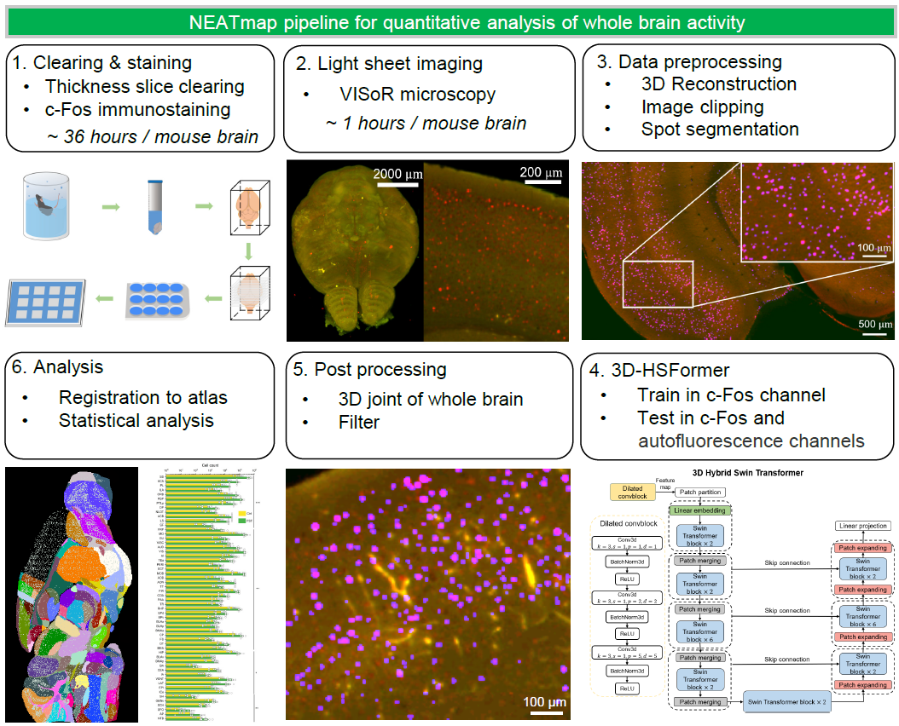

NEATmap
========

*NEATmap* is a toolbox for the semi-automatic analysis of volumetric data from [VISoR](https://github.com/BilabOptics/VISoR_code/).

*NEATmap's* tool box includes functional modules such as data preprocessing, neural network, post-processing, and quantization analysis.

## High-speed volumetric imaging </a>

Single channel imaging in adult mouse within ~0.5 hours. (Voxel size 1 x 1 x 3.5 $μm^3$)

## High-precision whole-brain automatic segmentation </a>

Complete whole-brain volumetric image segmentation in ~20 minutes.

## Whole brain and hierarchical brain regions analysis

Comprehensive analysis of neuronal activity.

## Background

*NEATmap* was designed to analyze volumetric images imaged by [VISoR](https://github.com/BilabOptics/VISoR_code/) light-sheet microscopy.

*NEATmap* tools can also be used to analyze data from other microscopy imaging, where neural networks can replace other networks that can be fed into the volumetric image.

## Application

*NEATmap* was developed to help researchers studying the brain field to be able to acquire data and analyze it efficiently and accurately (TB).

## Installation

NEATmap is written in Python 3 and is available for Windows and Linux systems.

The list of names of python libraries required by NEATmap can be found in the environment file `NEATmap.yaml`.
    
    $ conda env create -f NEATmap.yaml

Similarly, you can install other python dependencies via pip and use

    $ pip install name

## Tutorials

Tutorials for NEATmap are avaiable as [jupyer](https://jupyter.org/) notebooks:

  * NEATmap

## Data availability
The mouse whole brain dataset is available for download at [Zenodo](https://zenodo.org/record/8133486).

## References
  ### Unpublished
  NEATmap: a high-efficiency deep learning approach for whole mouse brain neuronal activity trace mapping submitted to *National Science Review*.
## License
This project is licensed under the [GNU General Public License v3.0](LICENSE).
